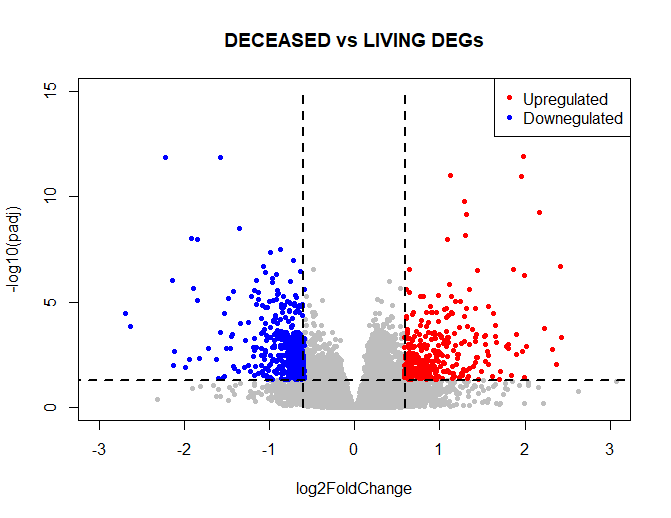

# Integrative Analysis of Gene Expression and MicroRNA Expression in Preprocessed TCGA Data for Skin Cutaneous Melanoma (SKCM)

## **Melanoma RNA-seq and miRNA Analysis**

This repository contains code and documentation for analyzing RNA sequencing (RNA-seq) and microRNA (miRNA) expression data in melanoma patients using R programming. The study leverages TCGA melanoma datasets to identify differentially expressed genes and miRNAs that may serve as potential biomarkers for melanoma detection, progression, and treatment.

---

## **Table of Contents**
1. [Introduction](#introduction)
2. [Data Sources](#data-sources)
3. [Visualization](#visualization)
4. [RNA-seq Methodology](#rna-seq-methodology)
5. [Features](#features)
6. [miRNA Analysis Results](#miRNA-Analysis-Results)
7. [Gene Expression Analysis Results](#Gene-Expression-Analysis-Results)
8. [Enrichment Analysis](#enrichment-analysis)
9. [Integromics Analysis](#integromics-analysis)
10. [Contributors](#Contributors)
11. [Acknowledgments](#Acknowledgments)
12. [License](#license)

---

## **Introduction**

Melanoma is a type of skin cancer that develops when melanocytes—the cells that produce melanin, the pigment responsible for skin color—begin to grow uncontrollably. While melanoma primarily affects the skin, it can also form in the eyes or other parts of the body, such as the nose or throat. Although melanoma is less common than other types of skin cancer, it is more dangerous due to its high likelihood of metastasizing to other areas if not detected early.

Exposure to ultraviolet (UV) radiation from sunlight and tanning lamps is the leading cause of melanoma, although other genetic and environmental factors contribute. Melanoma can sometimes develop in areas not exposed to sunlight, indicating other underlying factors.

This study leverages preprocessed data from **The Cancer Genome Atlas (TCGA)** to provide an integrative analysis of gene expression and miRNA profiles in melanoma. The goal is to identify differentially expressed genes and miRNAs that may serve as biomarkers for melanoma detection, progression, and treatment. Specifically, this research compares gene and miRNA expression in melanoma patients (diseased) to healthy controls, focusing on survival and disease status.

---

## **Data Sources**

This analysis uses data retrieved from **The Cancer Genome Atlas (TCGA)** for melanoma patients. You can access the relevant data via the following links:
- **TCGA Melanoma Data**: [TCGA Melanoma Data](https://acgt.cs.tau.ac.il/multi_omic_benchmark/download.html)
- **Project Data**: [Google Drive - Project Files](https://drive.google.com/drive/folders/1mVOsP3TBsUwEyCY9visGcA9QlG_eZB_e?usp=drive_link)
- **GSEA Data**: [Google Drive - GSEA Files](https://drive.google.com/drive/folders/1IabRpZM-N7r4LOFnk0K70PEQtUHljagN?usp=drive_link)
- **Supplementary Data**:[Google Drive - Supplementary Data](https://drive.google.com/drive/folders/1Q-6UKZzoDq6cfKrt9sdpUjUiOxvUbMKQ?usp=drive_link)

---

## **Features**
- **Data Preprocessing**: Handles data cleaning, missing value removal, and formatting to ensure compatibility with metadata.
- **Differential Expression Analysis**: Identifies significantly upregulated and downregulated genes and miRNAs using DESeq2.
- **Visualization**: Generates key plots (histograms, box plots, QQ plots, volcano plots, heat maps, PCA) for exploring and interpreting the data.
- **Enrichment Analysis**: Conducts pathway and functional analysis using GProfiler and Gene Set Enrichment Analysis (GSEA).

---

## **Visualization**

Several key visualizations are generated to explore and interpret the data:
1. **Histogram**: Displays the distribution of gene/miRNA expression.
2. **Box Plot**: Visualizes scaled data for better comparison.
3. **QQ Plot**: Assesses normality of data distribution.
4. **Volcano Plot**: Highlights significant differentially expressed transcripts.
5. **Heat Map**: Visualizes the most significant miRNAs/genes.
6. **PCA Plot**: Reduces dimensionality and visualizes clustering.
7. **GSEA**: Enrichment analysis based on gene sets, with tools like **GProfiler** and **GSEA** used for pathway identification.

---

## **RNA-seq Methodology**

### **Overview of Analysis**

The analysis is performed using R programming, specifically through scripts executed in RStudio. The goal is to identify differentially expressed miRNAs (transcripts) between two groups—control (healthy) and melanoma patients (survival and diseased). The focus is on detecting miRNAs that could potentially serve as biomarkers for melanoma.

### **Differential Expression with DESeq2**

To perform differential expression analysis, the **DESeq2** Bioconductor package is used. DESeq2 measures the log2 fold-change (FC) of miRNAs between two experimental conditions (diseased vs. living). A log2 fold-change less than 1 is considered negative, while values above 1 are positive.

**DESeq2** utilizes the negative binomial distribution, Wald, and Likelihood Ratio Tests to identify statistically significant genes and miRNAs. This package normalizes data by calculating the geometric mean of miRNA counts across all samples and adjusting for potential biases due to library size and RNA composition.

### **Data Preprocessing and Quality Control**

The dataset consists of **452 samples** and **1046 miRNAs**. The following preprocessing steps were applied to ensure compatibility with DESeq2:
- The miRNA count table was matched with the metadata file, ensuring that columns (samples) in the data matched rows (samples) in the metadata.
- Sample names were standardized across both datasets.
- Data values were converted to integers, as required by DESeq2.
- The "vital status" column, which serves as the design matrix for DESeq2, was cleaned to remove any missing values (NA).

### **Differential Expression Analysis**

DESeq2 was used to compare two conditions: **diseased** vs. **living** patients based on the "vital status" column in the metadata. The steps involved:
- Defining a **contrast** between the two conditions.
- Identifying differentially expressed transcripts (DETs) with an adjusted **p-value < 0.05** and **fold change > 1.2**.
- This resulted in the identification of three significant miRNAs, which could potentially serve as biomarkers for melanoma.

---

## **miRNA Analysis Results**

1. The distribution of miRNA expression data was visualized using a histogram, which indicated that the data is **right-skewed** and **not normally distributed**.
   
2. To scale the data, a log2 transformation was applied. The resulting box plot confirms the right-skewed nature of the data. A "+1" was added to avoid infinity when transforming zero values, but the distribution remained non-normal.

3. Normality was tested using a QQ plot, which revealed that the data is **not normally distributed** as the data points do not align with the normal distribution line.

4. The volcano plot visualizes differentially expressed miRNAs. The **blue color** indicates **upregulated miRNAs**, and the **red color** indicates **downregulated miRNAs**. A total of **three significant miRNAs** were identified, based on a **p-adjusted value < 0.05** and **log2FC > 1.2** (for upregulated miRNAs) and **log2FC < -1.2** (for downregulated miRNAs). Specifically, **two miRNAs were downregulated**, and **one was upregulated**.

5. A heat map was generated to visualize the three significant differentially expressed miRNAs (p-adjusted < 0.05 and log2FC > 1.2). These miRNAs could potentially be used as biomarkers for melanoma detection and progression. However, since the dataset consists only of **case samples** (both deceased and living), the results cannot be conclusively interpreted as biomarkers for melanoma detection.

6. Principal component analysis (PCA) was performed to visualize data variability:
   - PCA for **vital status** (diseased vs. living) showed 37% variance explained by PC1 and 13% by PC2, indicating that PC1 captured the most data variability.
   - PCA for **gender** (male vs. female) did not show significant clustering based on gender.

### **Gene Expression Analysis Results**

1. **Data Distribution**: The **gene expression data** was also found to be **right-skewed** and **not normally distributed**, as confirmed by the histogram, QQ plot, and box plot.

2. **Volcano Plot & Heat Map**: Differential expression analysis using **DESeq2** identified **64 significantly expressed genes** in deceased melanoma patients. Of these, **41 genes were upregulated**, and **23 genes were downregulated**. This was visualized using:
   - **Volcano plot**, where **red dots** indicate **upregulated genes** and **blue dots** indicate **downregulated genes**.
   - **Heat map** showing the most significantly differentially expressed genes.
  

3. **PCA**: PCA was performed on the gene expression data, with the first principal component (PC1) explaining **24% of the variance**, and the second principal component (PC2) explaining **19%**. The PCA plots based on **vital status** and **gender** did not show any clear correlation between these factors and gene expression, as the data points were randomly distributed.

---

## **Enrichment Analysis**

### (1) **GProfiler**
GProfiler is a web-based platform that conducts Gene Set Enrichment Analysis (GSEA) on a given list of genes. It utilizes gene-to-function mapping algorithms to identify statistically significant functional terms, such as biological pathways and processes that are over-represented among the input genes.

In this study, we applied GProfiler to analyze the differentially expressed genes in a cutaneous melanoma (SKCM) dataset. The results showed significant enrichment of the surfactant metabolism pathway and the **colony-stimulating factor receptor A (CSF2RA)** gene in the Reactome database, with no hits in the KEGG database. These findings suggest a correlation between the differentially expressed genes in SKCM and pulmonary diseases, as both pathways are associated with lung-related disorders.

### (2) **Gene Set Enrichment Analysis (GSEA)**
Gene Set Enrichment Analysis (GSEA) is a computational approach that evaluates the overrepresentation of a pre-defined set of genes in a given sample or dataset. GSEA was used to compare gene expression in deceased vs. living individuals.

Results showed that 27 out of 50 gene sets were enriched in the deceased group. Specifically, the **Human Gene Sets HALLMARK_MITOTIC_SPINDLE** (Fig. 14) and **HALLMARK_G2M_CHECKPOINT** (Fig. 15) were among the enriched gene sets, suggesting potential roles in cell cycle regulation and tumor progression.

---

## **Integromics Analysis**

The increasing accessibility and accuracy of high-throughput sequencing, along with the rise of other omics data (e.g., metabolomics and proteomics), have prompted the integration of multiple data modalities. However, the computational challenges involved in integrating different omics data, such as normalization method variations and missing data, remain significant. Multi-Omics Factor Analysis (MOFA) addresses many of these challenges by providing a statistical framework that integrates diverse data types.

### MOFA Application and Results
MOFA is a matrix factorization technique that differs from PCA in its ability to infer interpretable low-dimensional representations in terms of latent factors. It requires relatively large sample sizes and handles missing data. In this study, MOFA was applied to integrate transcriptomic, miRNA, and methylation data. The model identified key factors that account for the most variation in the data:

- Factor 1 had a significant effect on the **methylation** model.
- Factor 2 influenced **transcriptomic** data, and Factor 3 showed similar effects on **miRNA** data.

Enrichment analysis of high-weight features (genes) from Factor 2 revealed significant associations with structural functions in the skin, such as **keratinocyte differentiation**, **keratinization**, and **epidermis development**. Reactome pathways indicated that these genes are involved in **cornified envelope formation** and **keratinization**. However, no significant pathways were identified in the KEGG database.

### MOFA Variance and Features
The heat map plots show the weights of the top factors, revealing how these factors upregulate or downregulate features in each omic dataset. Annotations using metadata (e.g., gender, tumor tissue site, and vital status) did not reveal clear correlations with these factors.

---

## **Contributors**

- Mohamed Elmanzalawi [Linkedin](www.linkedin.com/in/mohamed-elmanzalawi) 
- Menna Ramadan  
- Mohamed Aboalkasem

---

## **Acknowledgments**
We express our sincere gratitude to Prof.Mohamed Mysara [Linkedin](https://www.linkedin.com/in/mohamed-mysara-06bb265b/) for his invaluable supervision and guidance throughout the project.

---

## **License**

This project is licensed under the MIT License - see the [LICENSE](LICENSE) file for details.

